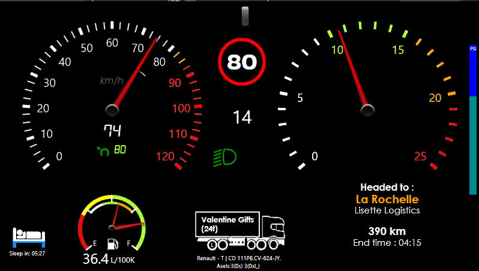

# A SimHub Dashboard for ETS2

A SimHub dashboard intended for Euro Truck Simulator 2 telemetry.

## Installation Guide

* **Download and install the latest release of [SimHub](https://www.simhubdash.com/)**

* Download the [dash](ETS2Simple.simhubdash) file
* Import the file into SimHub
* Adjust the dashboard variables
  * Crawler Gears: If your transmission uses crawler gears, put the number in here, otherwise put 0
  * ShowPSI: Want a brake PSI meter? Say true here. Want it off, say false.
  * ShowSteeringIndicator: true/false
  * ShowEffeciency: true/false, show your fuel consumption on the dash.
* Enjoy.

## Dashboard screenshot

## Features

* Lists your current freight and it's weight
* Time until end-of-job
* Time until next rest stop
* Indicates if your truck and trailer have liftable and steerable axels
* Indicates graphically if your liftable axels are lifted
* Speed gauge knows about speed limit and adjusts coloration accordingly 
* Combined fuel and consumption gauges
* Break PSI gauge (Togglable)
* Steering angle indicator (Togglable)
* Gear indicator, which can be configured to display crawler gears and multiple reverse gears correctly
* Gauges dim to indicate electricity/engine are off
* Indicators for Cruise set and speed, low and high beams, parking break, retarder, engine break, check engine light, speed limit, and turn signals
* Truck make, model, and plate number, and plate numbers for attached trailers
* Indicator for charges from law-breaking, buying fuel, paying toll, ferry, and train fees
* Some UI Elements can be toggled on/off via Dashboard Variables
  * ShowPSI - Shows the PSI Gauge on the right
  * ShowSteeringIndicator - Shows the wheel icon at the top
  * ShowEfficiency - Shows the efficiency dial/text on the gas gauge
  * ShowFuelNumber - Shows the number of Liters of fuel in the tank
* Some UI elements can be configured via Dashboard Variables
  * CrawlerGears - Set to 0 if your transmission doesn't have Crawler gears
  * FeeShowTime_set - How many seconds should the Fee/Charges notification show, can include fractions of a second like 3.25 for 3 and a quarter seconds

## Changes in latest update

* Work started on having the RPM redline be adjustable in Dashboard Variables
* Fixed the Fuel gauge not showing in android app and webpage version (Not sure what caused that, just re-created it, and now it works?)
* "radial gauge" on the speedometer now links to the set Cruise Control value, showing if you're moving faster/slower than your cruise setting
* Added text to indicate how much fuel is in the tank (promptly turned it off for myself when I fixed the gas guage)

## Todo

* Have RPM gauge adjust green, yellow, red lines automatically based on game values
  * Need to investigate GameRawData.TruckValues.ConstantsValues.MotorValues.EngineRpmMax and GameData.CarData.CarSettings_CurrentGearRedLineRPM and other data points
  * Possibly make it a dashboard variable, like crawler gears
* Buy American Truck Simulator and see what needs to be changed to work there? Graphic and units changes, of course, anything else?
* Make configurable for Metric/English units?
* Test with makes and models of trucks, currently tested:
  * Renault -T
  * Mercedes - New Actros
  * DAF - 2021
* Odometer/Trip displays?

## What's outright not working, impossible, or problematic

* I'm not exactly happy with the way I'm indicating Liftable and Steerable axels on the truck/trailer graphics (LS text over wheels)
* Nor that the liftable axels don't color code correctly for damage
* Does not appear to be possible to display hired driver income or bank payments
* Trip odometer value doesn't seem to be an exported value
  - SessionOdo and StintOdo both seem to show the same value
  - Neither of them seem to show *trip* odo, just since you started the session or I think powered on your truck, not super helpful for ETS
* Consumption value is litrers/100Km average since trip reset
  * Would have liked to do an immediate consumption value instead/in addition, but ETS2 does not export that value that I could find
  * Does this change based on the make/model? Possibly, had to add an inertia() function with the New Actros to prevent it from having odd jitter
